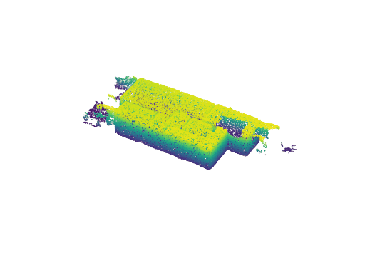
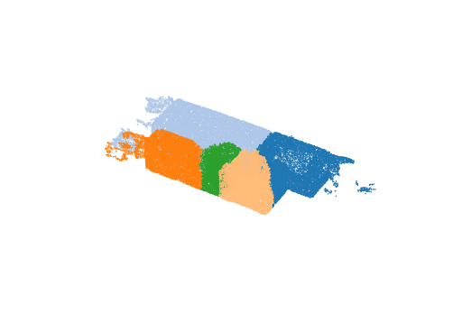
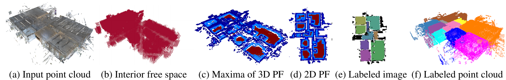
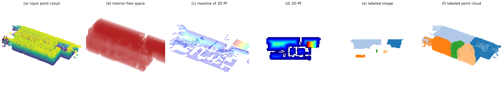

# Room Segmentation in 3D Point Clouds

A compact, from-scratch Python implementation of

> D. Bobkov, M. Kiechle, S. Hilsenbeck, E. Steinbach,
> **"Room segmentation in 3D point clouds using anisotropic potential fields"**, IEEE ICME 2017.
> [Project page](https://dbobkov.github.io/room-segmentation/) · [Paper](https://dbobkov.github.io/room-segmentation/assets/paper.pdf) · [DOI](https://doi.org/10.1109/ICME.2017.8019484)

| Input point cloud | Segmented rooms |
|---|---|
|  |  |

## Pipeline

1. **Voxelize** the bounding box (0.18 m voxels); a voxel is *busy* iff it contains a point.
2. **Clutter removal** — busy voxels matching the vertical *busy-free-busy-free-busy* pattern (furniture) are freed.
3. **Interior detection** — enclosure evidence per voxel (Eq. 1, dominant horizontal directions estimated from wall normals) feeds an MRF over free voxels, solved exactly by min-cut (`scipy.sparse.csgraph.maximum_flow`).
4. **Anisotropic potential field** — each interior voxel stores the distance to the nearest busy voxel in the upper half-space; per-stack maxima form a 2D PF map.
5. **Clustering** — HDBSCAN over the combined distance `D = 0.3·D_vis + 0.6·D_eucl + 0.1·D_pf` (Eq. 2), where `D_vis` compares ray-cast visibility vectors of stack-top voxels (Eq. 3); remaining cells join their nearest cluster.
6. **Back-projection** — 2D labels propagate down each stack, then every remaining occupied voxel takes the majority label of its 10 nearest labeled free voxels.

Pipeline overview as published (Fig. 2 of Bobkov et al., © 2017 IEEE, reproduced from the [project page](https://dbobkov.github.io/room-segmentation/) for comparison):



The same stages produced by this implementation on the bundled multi-room example (the hot spot in the PF panels is a hole in the scanned ceiling):



## Setup & usage

```sh
conda env create -f environment.yml
conda activate roomseg

python run.py examples/multiRoom_input1.ply
python run.py examples/singleRoom_input1.ply
```

Outputs land in `out/`: a labeled PLY (`label` per vertex, -1 = unassigned), the PF map, and rotating 3D renders of the input and segmented clouds. Use `--up z` for Z-up clouds (bundled examples are Y-up), `--voxel` to change resolution, and `--vis-targets N` to subsample visibility targets on very large scenes.

## Parameters (paper defaults)

| Parameter | Value | Where |
|---|---|---|
| Voxel size | 0.18 m | §3.1 |
| Enclosure evidence weights w₁…w₅ | 0.43 / 4 × 0.1425 | Eq. 1 |
| MRF smoothness | 0.6 | §3.1 |
| Distance weights (vis / eucl / PF) | 0.3 / 0.6 / 0.1 | Eq. 2 |

## Benchmarks

multiRoom example (339k points), Apple M4, single process. Peak RSS includes the ~160 MB Python/numpy baseline.

| Stage | Time | Peak RSS |
|---|---|---|
| Voxelize + clutter removal | 0.00 s | 220 MB |
| Interior MRF (min-cut) | 1.07 s | 333 MB |
| Potential field | 0.03 s | 333 MB |
| Visibility (1801² rays) | 5.22 s | 568 MB |
| Clustering | 0.10 s | 637 MB |
| Back-projection | 0.18 s | 637 MB |
| **Total** | **6.6 s** | **637 MB** |

Result: 5 rooms, 100 % of points labeled.

## Layout

```
run.py                CLI: segment + render
roomseg/
  io.py               PLY I/O, up-axis handling
  grid.py             occupancy voxel grid
  interior.py         clutter removal, evidence, MRF graph-cut
  field.py            anisotropic PF, visibility ray-casting
  cluster.py          histogram thresholds, HDBSCAN (Eq. 2/3)
  pipeline.py         orchestration, back-projection, benchmarks
examples/             two sample scans (binary PLY, Y-up, with normals)
```
